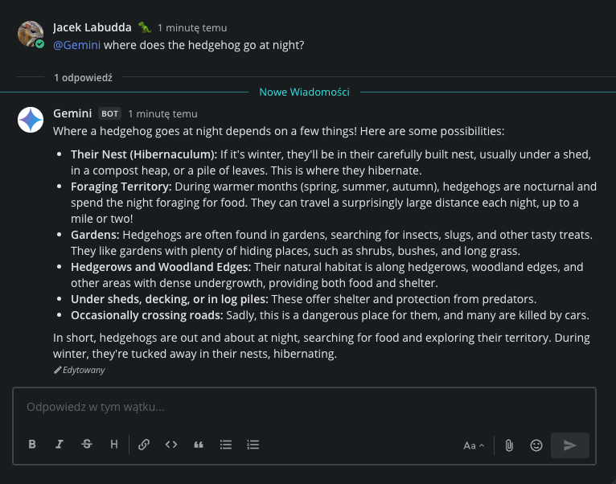

# Gemini Mattermost
This project integrates Google Gemini with Mattermost to enable AI-assisted chat interactions directly in your Mattermost instance.

## 🔧 Features
- Responds to user messages in Mattermost using Gemini
- Automatically handles context and thread history
- Configurable via environment variables
- Can run as a background service with systemd

## 🚀 Installation
```shell
git clone https://github.com/JacekLabudda/mattermost-gemini.git
cd mattermost-gemini

python3 -m venv .venv
source .venv/bin/activate

pip install -r requirements.txt
```
## ⚙️ Configuration
Edit the `run.sh` file and set your credentials:

```shell
vim run.sh
```
Set the following environment variables:

| Variable | Description |
| ---- | ---- |
| MATTERMOST_URL | Mattermost server URL |
| MATTERMOST_PORT | Mattermost port (default: 8065) |
| MATTERMOST_API_PATH | API path (usually /api/v4) |
| BOT_TOKEN | Bot token from Mattermost |
| GEMINI_API_KEY | Your Google Gemini API key |
| GEMINI_MODEL | Gemini model (e.g., gemini-2.0-flash) |

## ▶️ Run the Bot
```shell
chmod +x run.sh
./run.sh
```
## 🛠️ Run as a Service (systemd)
To run the bot automatically at startup as a service:

1. Create a systemd service file:

```shell
sudo nano /etc/systemd/system/gemini.service
```
Paste the following:

```shell
[Unit]
Description=Gemini Mattermost Bot
After=network.target

[Service]
Type=simple
ExecStart=/path/to/mattermost-gemini/run.sh
WorkingDirectory=/path/to/mattermost-gemini
Restart=always
User=root
Environment=PYTHONUNBUFFERED=1

[Install]
WantedBy=multi-user.target
```

🔒 Tip: Replace `/path/to/mattermost-gemini` with your actual path. Use a non-root user if possible.

2. Reload `systemd` and enable the service:

```shell
sudo systemctl daemon-reexec
sudo systemctl daemon-reload
sudo systemctl enable gemini.service
sudo systemctl start gemini.service
```
3. Check the status:

```shell
sudo systemctl status gemini.service
```
## 📁 File Overview
- `run.sh` – Startup script for configuring environment and running the bot
- `gemini.py` – Bot logic integrating Mattermost with Gemini
- `requirements.txt` – Python dependencies
  


🤝 Contribute Got ideas or improvements? PRs and issue reports are welcome!
📜 License MIT - use it freely, just mention me or leave a ⭐ if you like it.